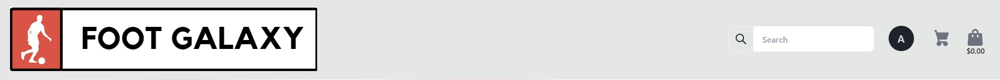
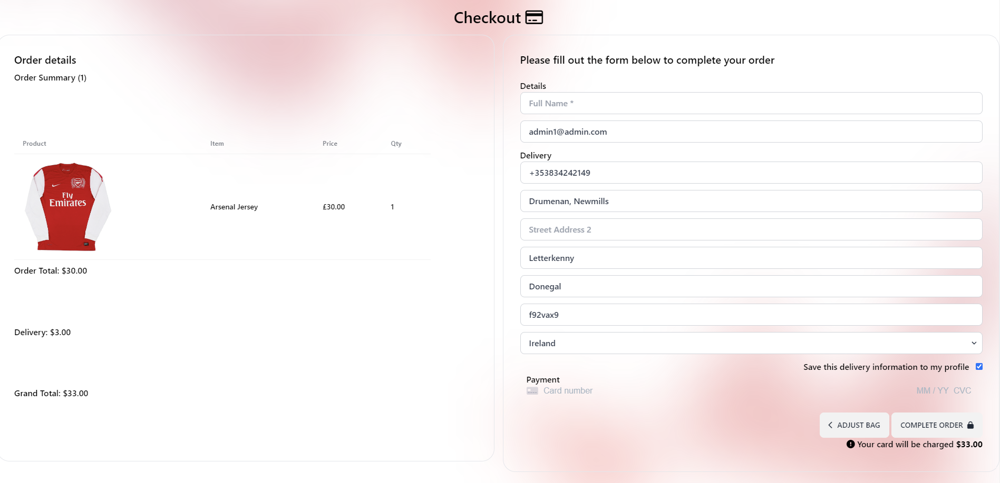

# Foot Galaxy

Telephile is an E-commerce store for a multinational business that sells classic and modern football jerseys to fans and collectors around the world. Shoppers can sign up and create an account, browse the store's jerseys and make purchases through the checkout. Shoppers gain a user profile when signing up where they can view past orders and save their personal info, the site also lets them review the business and save items to their wishlist. 

You can find the live site [Here](https://foot-galaxy-e4d24e6240cb.herokuapp.com/).

 
Please do not input your own credit card details. While purchasing a product please enter the following digits to make use of the checkout system. 
 
Card number: 4242 4242 4242 4242. Expiry: 42/42. CVC: 424. PostCode: 42424. 

####

&nbsp;

&nbsp;

# Purpose
I built this website as my fifth and final project for the code institutes full stack development and e-commerce applications course. 
I built this website from scratch using the Django framework and the knowledge I gained while studying at the code institute where I have learned the basics of Python, HTML, Javascript and CSS.

# Target audience
* Football Fans
* Shirt Collectors 
* Fashion lovers 

# User Experience 

 

## Site Aims

* Provide football lovers with a store to purchase classic football shirts.
* Get as many users signed up as possible. 
* Create a good relationship with customers and keep them returning. 

# Design 

## Agile Methodology 
The agile methodology was implemented in the design of this project. The project was planned on github using the project board feature.
* You can find the project board [Here](https://github.com/users/Mcdaid101/projects/3).
* The project board consists of three sections: 
* 1. Todo 
* 2. In progress 
* 3. Done.
* Each user story was drawn up in the issues section of github and passed on to the kanban where once added to the project board, it was placed in the todo section. Once a user story was undertaken it was then moved into "in progress"section and when finally implemented and complete moved into the third. 
 

## User stories
### First iteration
* 1. As a shopper I want to view products the site is offering.
* 2. As a shopper I want to be able to view the info on a product such as its name, price and size.
* 3. As a shopper I want to be able to apply different filters to products to filter and view them by price, in alphabetical order etc.
* 4. As the site admin I want to be able to edit pricing, images and description.
* 5. As the site admin I want to be able to add new products for sale and delete products if they are no longer being sold.
### Second iteration
* 6. As a shopper I want to be able to view a FAQ section for any frequently asked questions.
* 7. As a shopper I want to be able to add products to my basket and view them before proceeding to the checkout.
* 8. As a shopper I want to be able to remove items from my basket
* 9. As a shopper I want to view my order details before I checkout.
* 10. As a shopper I want to be able to enter payment info quickly and easily and save it for the future.
* 11. As the site admin I want to be able to view orders made by customers to ship them as soon as possible.
### Third iteration
* * 12.  As a shopper I want to be able to create an account to be able to interact with the site and feel a part of it.
* 13. As a shopper I want to be able to log in and out of my account on the site.
* 14. As a shopper I want to be able to view my past orders on my profile
* 15. As a shopper I want to be able to save items to my account to show I like them and would maybe like to purchase them in the future.
* 16. As a shopper I want to receive a confirmation email when signing up.
### Fourth Iteration
* 17. As a site owner I want to be able to add, update and delete products from the main site
* 18. As a shopper I want to know the location of the site’s store so I can shop there in person.
* 19. As a shopper I want to be able to leave a review on the site’s services.
* 20. As a shopper I want to be able to recover my password if I have forgotten it.
* 21. As a shopper I want to receive regular news on the site and new products/plans via email.
* 22. As the site admin I want to create a mailing list for subscribers to the site’s newsletters.
* 23. As a shopper I want to be able to access the site’s social media to keep up to date with new plans and products.

### Future features 
* Order confirmation email.
* The ability for the site admin to manage review via the website ui.
* A football training plan subscription section giving users the chance to subscribe and unsubscribe
 

# Business Model 
Foot Galaxy's Business model is a Business to customer model. As Foot galaxy aims to sell products directly to consumers. See below the techniques Foot Galaxy use to implement their business model and boost sales and growth. 

# Search engine optimization
For SEO I searched Wordtracker.com for my keywords which I included in the meta tags to promote SEO. I entered these words into google and compared them to the sites and words that would come up along wit the "People also searched for" sections. I then added what I thought were the most relevant to my meta tags and added them as much as possile in my site. 

## Robots.txt and Sitemap
To further boost SEO I created a robots.txt file and added a sitemap along side this which I downloaded from XML-sitemaps.com.

# Marketing

* Marketing at Foot Galaxy will be mainly done through social media as it is a large Business to customer company. The store runs a facebook page titled Foot Galaxy and shoppers can find out more about the store there and receive any updates on new deals and future events. 

* Email marketing is also a key part of Foot galaxy. Users can subscribe to Foot Galaxy's mailing list via the home page to receieve news on products, sales and more. The mailing list also updates shoppers on the store's weekly 5 a side a sessions too if they want to attend. 

## Wireframes and Schema

Wireframes

Database Schema

Site Flow Chart

I sketched this chart out at the beginning of development, the future feature nutrition plans did not make it to development in the end. 

## Design choices 
 

### Colour scheme
The colour scheme of the website is a simple white with flashes of red in the background, easy on the eye and stylish and modern. When the site is viewed on a device on dark mode, the colour scheme automatically switches from white to black, along with the font from black to white. This is a feature of tailwind's css. 

### Dark mode contrast

### Font 
The font for this site is the generic arial sans serif, a classic font that works well on all sites. I observed it was used across most modern websites and e commerce stores and implemented it here also. 

## Features
 

### Nav bar
To navigate the site Users use the nav bar at the top of each page.
The nav contains a search bar and links to shop and access the users profile along with the shopping bag. On smaller screens a burger button replaces these items and they move to a drawer. 

### Footer
Similar to the nav bar the footer appears on each page and has a sticky effect. The footer contains links to the site's social media and info pages. .

### Home
The home page where the user is first directed to contains links to start shopping and find out more about the site along with cards offering more info and buttons to browse products. The bottom also hosts a subscribe to our mailing list and 5 a side info box. 

### Profile
The profile page is only access if a user is logged in. It contains the users past orders and their personal info which they can update and use in the future.

### Products
The products page displays the sites products and allows user to categorize and sort them in various different ways using the buttons at the top of the page.

### Product Detail
The products details page is accessed when the user clicks on a product. If the user is signed in they can save the item to their wishlist. If the site admin is signed in they can edit the products info or even delete it using the buttons provided. 

### Saved Products
The saved products page displays the user's saved products and allows user to delete them if they wish. 

### Add a Product
The add product view is only accessible for the site admin via the nav bar. 

### Edit a Product
The edit product view is only accessible for the site admin via the nav bar. 

### Bag
The site bag renders what the user has added to it and allows them to then proceed to checkout and purchase them. Users can also remove items from their bag and view details on their products. 

### Checkout
The checkout page shows again what items the user is purchasing and it's info and a payment form. The user can save their info if they are logged in. A stripe API card payment form is located at the bottom of the page along with a secure checkout button. 

### Checkout Success
The checkout success page is rendered if the user successfully makes a payment. Once their payment goes through they will be met with this screen and given an order number. The user can then find this order in their profile in the previous orders section if logged in. 

### About
The about page informs the user about the history of the company and on store location. 

### FAQS
The FAQS page answers any common questions about the site and provides a returns policy. 

# Technology Used 
 

## Languages 
* Python
* HTML
* CSS 
* Javascript
* Jquery
* Tailwind Css

 

## Tools and Frameworks
* Git 
* Github 
* Vs Code IDE in browser
* Django
* Postgres
* Techsini Multi Device Mockup Generator used in this readme to display an image of the website on different devices 
* Heroku -  Hosts live site
* Allauth - login and registration
* Tailwind CSS used to style and structure site 
* ElephantSQL - HOsts database
* Bootstrap 4 - Used for site structure and making the site responsive
* Basimiq - Created wireframes 
* Whitenoise - Hosts and displays static files and images for the site
* Amazon Web Services host static and media files
* Crispy forms - Improve the sites forms
* Crispy tailwind - styled the sites forms 
* Django storages - helped with file storages 
* Django browser reload - automatic browser reloads in development 
* Stripe API
* Pillow

# Bugs 

 

 

 

# Testing and validation

 

I have manually tested this project by doing the following:
* Passed the pages through the W3C HTML and CSS validators
* Passed the project through a pep8 linter and the Code Institute python checker and confirmed there is no problems.
* Tested in my gitpod terminal and the Heroku terminal.
* Tested each user story to make sure each one passes. 

W3C validations

Pep8
* No errors were returned from the code institute's python Linter or from extendsclass.com/pythontester.

Lighthouse testing
* At first my test results came up quite poor but after switching to an incognito window on chrome and downsizing the main hero image on the home page the site got a high score as seen in the images below. All pages got a similar result.
 

 

# Deployment 

## Creating this project
This project was created by navigating to the Code Institute's Gitpod student template and clicking the 'use this template' button. I then inputted the repository name "Foot Galaxy" and included all branches. With the repository now created, I used the browser version of Vs Code to create the project. 
 

I used the following commands throughout this project:
* Git add . - This added my file to the staging area to be committed
* Git commit -m - This command committed any changes to the local repository along with a message
* Git push - pushed my changes to the github repository and to Heroku 
* git reset --hard HEAD^ - This removed my last commit 
* python3 manage.py runserver - This ran my code in the terminal
* python3 manage.py makemigrations - This made my migrations
* python3 manage.py migrate - This migrated my changes to my databases

## Heroku
This website is deployed on Heroku

## Steps for deployment 
* Fork or clone this repository
* Linked the heroku app to the repository via github
* Clicked automatic deploys so each git push would automatically go to the heroku app
* This was ideal for testing so I could see what the site looked like on the Heroku terminal with each git push

 1. Create Django project and app 

* Install django using the command pip3 install 'django<4' gunicorn
* Then install the database libraries dj_database_url and psycopg2, using pip3 install dj_database_url psycopg2
* Then create the requirements.txt file using the command pip3 freeze --local > requirements.txt
* Then created my Django project with the command django-admin startproject project_name .
* I created the Django app with the command python3 manage.py startapp app_name
* I used the commands python3 manage.py makemigrations and python3 manage.py migrate to migrate my changes.
* To test and run the project I used python3 manage.py runserver.

 2. Create Heroku app 

* I opened the heroku website and logged into my account
* I created a new app with the project name
* Select region as Europe
* Open the Resources section and select Heroku Postgres
* Open the Settings section and select Config VARS, then add the keys needed to start development DATABASE_URL/SECRET_KEY/CLOUDINARY_URL, with Config VARS you add: PORT: 8000 + DISABLE_COLLECTSTATIC: 1;

 3. Set up Django settings.py and necessary folders/files 

* Set up to connect the environment variables
         from pathlib import Path
         import os
         import dj_database_url
         from django.contrib.messages import constants as messages
         if os.path.isfile('env.py'):
         import env
         
* Inside INSTALLED_APPS I added the necessary apps

* For the database I replaced it with the following code

        DATABASES = {
        'default': dj_database_url.parse(os.environ.get('DATABASE_URL'))
        }
        
* For the static files I replaced it with the following code to conect to Cloudinary

      STATIC_URL = '/static/'
      STATICFILES_STORAGE = 'cloudinary_storage.storage.StaticHashedCloudinaryStorage'
      STATICFILES_DIRS = [os.path.join(BASE_DIR, 'static')]
      STATIC_ROOT = os.path.join(BASE_DIR, 'staticfiles')

      MEDIA_URL = '/media/'
      DEFAULT_FILE_STORAGE = 'cloudinary_storage.storage.MediaCloudinaryStorage'
      
* Create a Procfile and add the following text

web: gunicorn autoclassic.wsgi

<h3> 4. Final deployment. </h3>

* In settings.py set the DEBUG = False;
* In Heroku I went back to Settings > Config VARS and removed the DISABLE_COLLECTSTATIC var;
* In Heroku I navigated to the Deploy section;
* I clicked to connect to GitHub and searched for my repository for this project;
* I clicked on manual deploy to build the App;
* When finished, I clicked the View button, which redirected me to the live site.

  

# Credits
* W3schools provided me with the code for my scroll to top of page function and my dark/light mode button. 

## Media 
* Site's posts feature image if unprovided: [here](https://www.pexels.com/photo/retro-tv-set-on-concrete-surface-5721869/)
* Posts feature image if unprovided: [here](https://images.pexels.com/photos/10599961/pexels-photo-10599961.jpeg?auto=compress&cs=tinysrgb&w=1260&h=750&dpr=1)
* Home page hero is from scontent on facebook image is [here](https://scontent-lcy1-1.xx.fbcdn.net/v/t39.30808-6/311134067_416071014039021_806491811075822809_n.jpg?_nc_cat=111&ccb=1-7&_nc_sid=e3f864&_nc_ohc=S21fvKd8L4YAX_OWoXn&_nc_ht=scontent-lcy1-1.xx&oh=00_AfA04p9E2-rNTd0Mg8B7RBirtWGhH-zMiavymSuL7Ks3zA&oe=646BFA28)

## Acknowledgements 
* I would like to thank my mentor Ronan Mc Clelland for his help and guidance while I built this project.
* I would like to thank my family for their love and support.
* And finally my girlfriend for her advice on my site's style. 